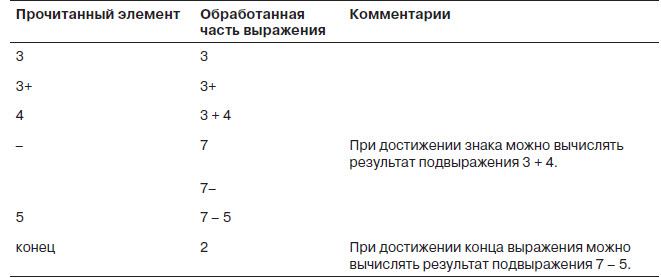
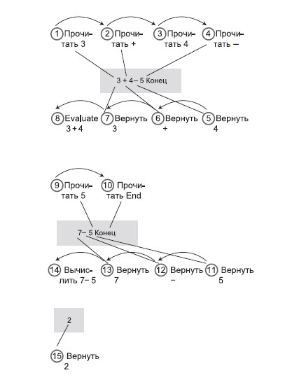

[Инфиксная и постфиксная запись](src/main/resources/images/infixAndPostfix.jpg)
________________________________________________________________________________
+ Вычисление результата выражения 3 + 4 – 5

________________________________________________________________________________
+ Вычисление результата выражения 3 × (4 + 5)

________________________________________________________________________________
+ Вычисление результата постфиксного выражения
1) 653+*725+/-
2) 6*(5+3)-7/(2+5)
3) 6*8-7/7
4) 48-1
5) 47